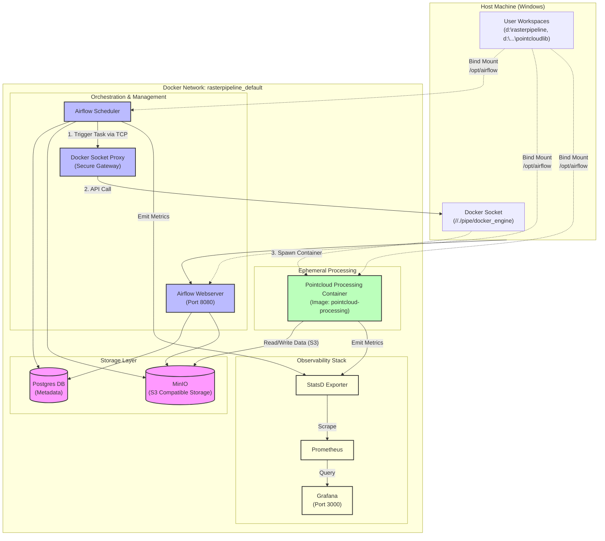

# Project Architecture

This document illustrates the high-level architecture of the `rasterpipeline` and `pointcloudlib` integration.

## System Overview

The system is designed as a **Docker-in-Docker** (or Docker-beside-Docker) pipeline orchestrated by **Apache Airflow**.

- **Orchestration**: Airflow (Scheduler & Webserver) runs in Docker containers.
- **Execution**: Heavy processing tasks are spawned as *ephemeral Docker containers* using `DockerOperator`.
- **Storage**: **MinIO** serves as the S3-compatible object storage for input/output data. **PostgreSQL** handles Airflow metadata.
- **Monitoring**: A full observability stack with **Prometheus**, **Grafana**, and **StatsD** is integrated.

## detailed Diagram

## Component Details

| Component | Service Name | Description |
|-----------|--------------|-------------|
| **Airflow Scheduler** | `airflow-scheduler` | Triggers DAGs and tasks. Uses `DockerOperator` to offload work. |
| **Airflow Webserver** | `airflow-webserver` | UI for monitoring DAGs. |
| **Socket Proxy** | `docker-proxy` | Securely exposes the host Docker socket to Airflow containers. |
| **PostgreSQL** | `postgres` | Stores Airflow state, users, and connections. |
| **MinIO** | `minio` | Stores raw point cloud data (`.las`, `.laz`) and processed outputs (`.tif`, etc.). |
| **Processing Image** | `processing-image` / `pointcloud-processing-image` | Custom Docker images containing `pointcloudlib`, `pdal`, and other dependencies. |