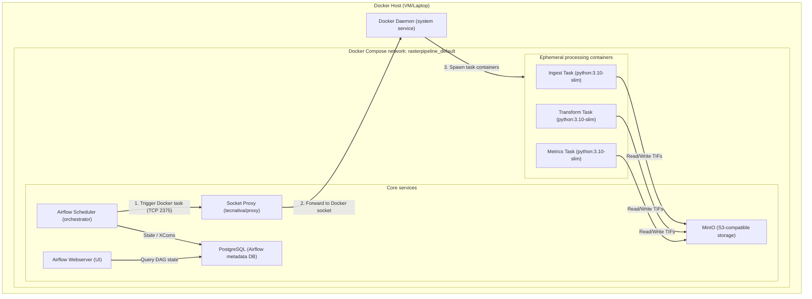

## Raster pipeline architecture

```mermaid

graph TD
    subgraph Host["Docker Host (VM/Laptop)"]
        DockerDaemon["Docker Daemon (system service)"]

        subgraph DockerCompose["Docker Compose network: rasterpipeline_default"]
            subgraph CoreServices["Core services"]
                Web["Airflow Webserver (UI)"]
                Sched["Airflow Scheduler (orchestrator)"]
                Postgres["PostgreSQL (Airflow metadata DB)"]
                MinIO["MinIO (S3-compatible storage)"]
                Proxy["Socket Proxy (tecnativa/proxy)"]
            end

            subgraph Ephemeral["Ephemeral processing containers"]
                Ingest["Ingest Task (python:3.10-slim)"]
                Transform["Transform Task (python:3.10-slim)"]
                Metrics["Metrics Task (python:3.10-slim)"]
            end
        end
    end

    %% Control flow
    Sched -- "1. Trigger Docker task (TCP 2375)" --> Proxy
    Proxy -- "2. Forward to Docker socket" --> DockerDaemon
    DockerDaemon -- "3. Spawn task containers" --> Ephemeral

    %% Data access
    Ingest -- "Read/Write TIFs" --> MinIO
    Transform -- "Read/Write TIFs" --> MinIO
    Metrics -- "Read/Write TIFs" --> MinIO

    %% Metadata
    Sched -- "State / XComs" --> Postgres
    Web -- "Query DAG state" --> Postgres

    linkStyle default stroke-width:2px,stroke:#333,fill:none


```